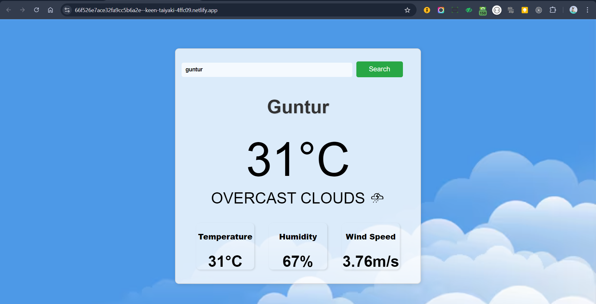
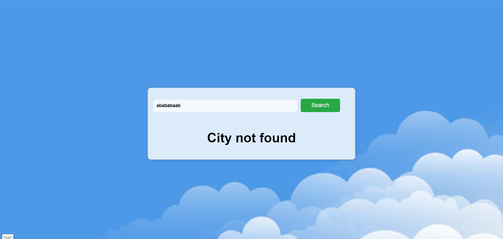

# CloudPlus
# Weather App

This is a simple weather application developed using **HTML**, **Tailwind CSS**, **React.js**, and the **OpenWeather API**. The app allows users to search for cities and view the current weather conditions, including temperature, humidity, and wind speed.

## Features

- Search for weather information by city name.
- Provides real-time weather data such as temperature, humidity, and wind speed.
- Auto-suggestions for major Indian cities.
- Responsive design using Tailwind CSS.

## Tech Stack

- **React.js**: JavaScript library for building user interfaces.
- **Tailwind CSS**: Utility-first CSS framework for styling.
- **OpenWeather API**: Provides real-time weather data for cities around the world.

## Setup Instructions

1. Clone the repository:

   ```bash
   git clone https://github.com/your-username/weather-app.git
#outputs


